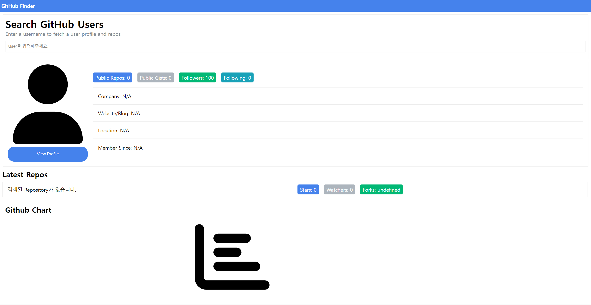
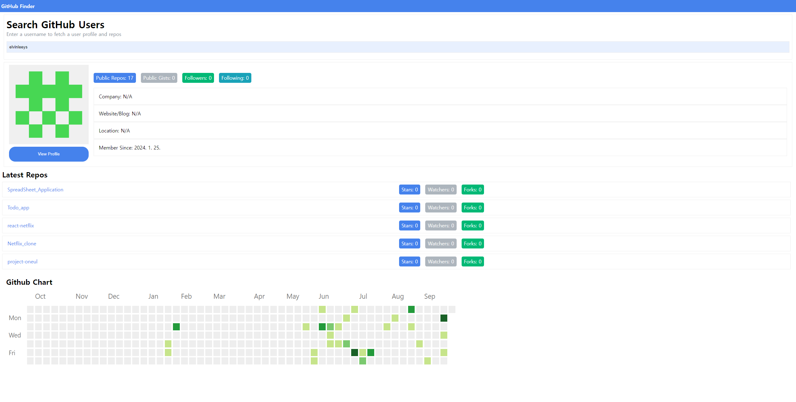
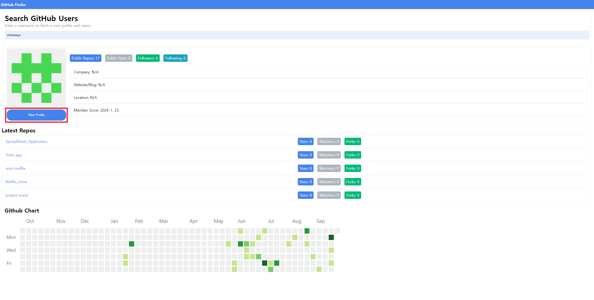
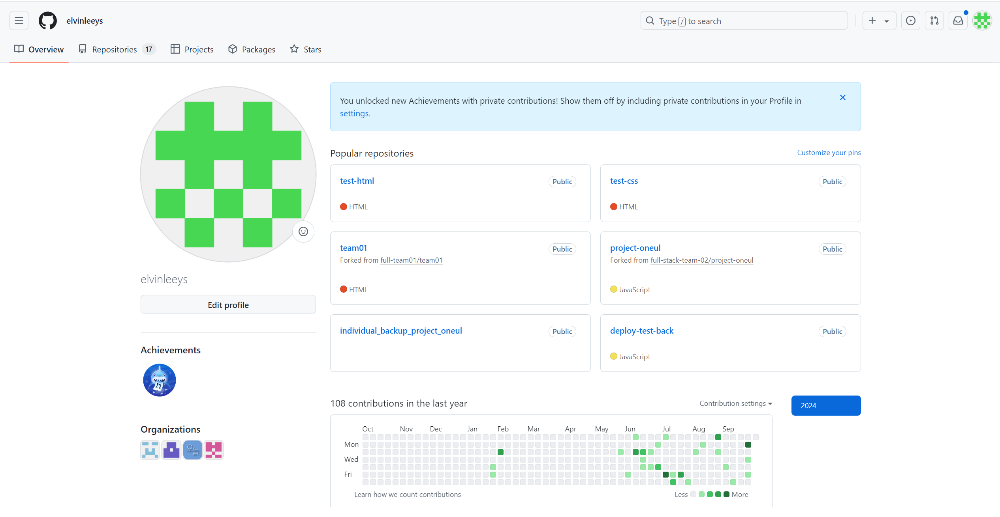
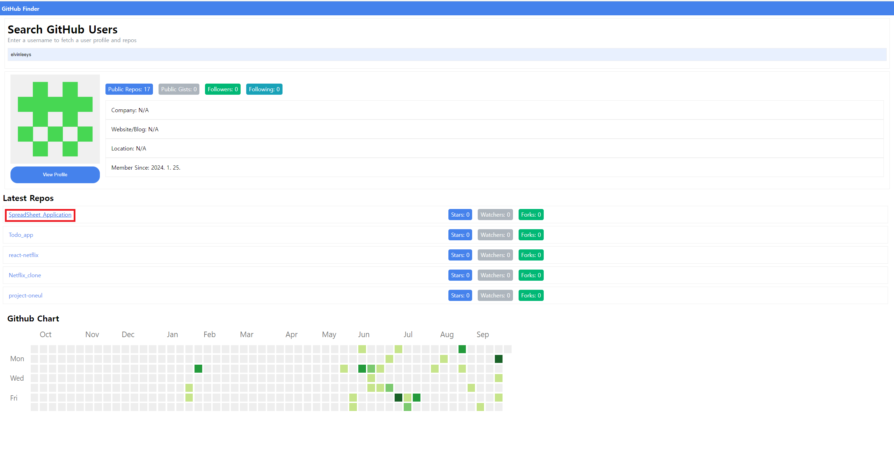
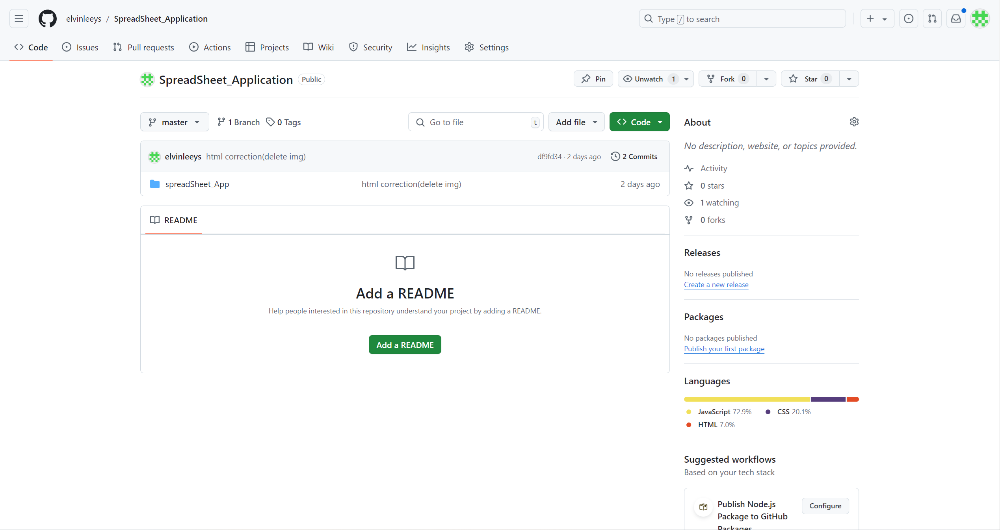

# GitHub Finder project
유저의 이름을 검색하여 해당 유저의 GitHub 정보를 불러오는 프로젝트

- 기능
    - user 검색
        - 실제 user 검색 화면

        

    - user의 profile(company, Website/Blog, Location 등)
        - ViewProfile 버튼
            - 클릭전
            

            - 클릭후
            

    - user의 repository 정보
        - repository 클릭 전
        

        - repository 클릭 후
        

    - Github chart(유저의 Github 잔디밭 정보)

※ 현재 src 경로에 apiKey.js 파일 생성후 GITHUB_TOKEN이란 변수에 github access key, 
   즉 api key를 넣어야 작동이 가능합니다.